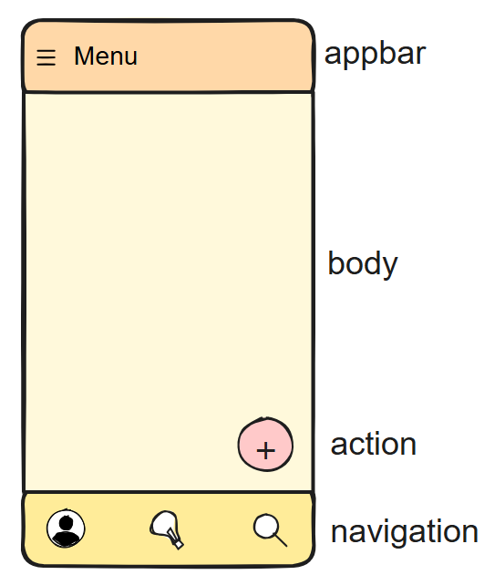
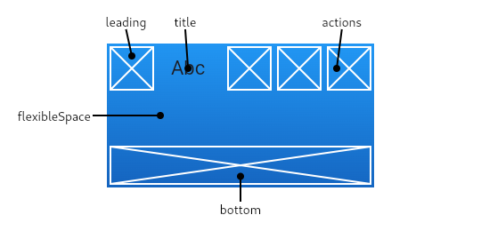

# Exemplo prático usando Scaffold

O Scaffold no Flutter é um widget que fornece uma estrutura básica visual para um app.



 Ele é como um "esqueleto" da tela, com áreas prontas para coisas comuns como:

| Propriedade             | Descrição                                                       |
|------------------------|------------------------------------------------------------------|
| `appBar`               | Barra superior do app. Usa `AppBar`.                             |
| `body`                 | O corpo principal da tela.                                       |
| `drawer`               | Menu lateral que pode ser aberto deslizando ou clicando no ícone.|
| `bottomNavigationBar`  | Barra de navegação inferior.                                     |
| `floatingActionButton` | Botão flutuante normalmente usado para ações principais.         |
| `backgroundColor`      | Cor de fundo da tela.                                            |


## appbar

A AppBar é a barra superior que aparece no topo de uma tela. É usada para mostrar o título, ícones de ação, menus, botão de voltar, etc.

| Propriedade               | Função                                                                 |
|---------------------------|------------------------------------------------------------------------|
| `title`                   | Texto ou widget que aparece no centro da barra                        |
| `backgroundColor`         | Cor de fundo da AppBar                                                 |
| `leading`                 | Widget à esquerda (ícone de menu, voltar, etc.)                       |
| `actions`                 | Lista de widgets à direita (ícones de ação como busca, notificações) |
| `centerTitle`             | Centraliza o título (padrão: `true` no iOS, `false` no Android)       |
| `iconTheme`               | Define cor, tamanho e estilo dos ícones                               |
| `automaticallyImplyLeading` | Define se o botão de voltar/menu aparece automaticamente             |



````dart
appBar: AppBar(
  title: Text('Minha AppBar'),
  backgroundColor: Colors.deepPurple,
  centerTitle: true,
  actions: [
    IconButton(
      icon: Icon(Icons.search),
      onPressed: () {
        // ação ao clicar no ícone
      },
    ),
  ],
),
````
## body

A propriedade body define o conteúdo principal da tela. É onde você coloca o que o usuário realmente vai ver e interagir: textos, botões, listas, imagens, formulários, etc.

| Propriedade            | Função                                                              |
|------------------------|---------------------------------------------------------------------|
| `child`                | Widget que será exibido dentro do `body`. Pode ser qualquer widget. |
| `alignment`            | Define o alinhamento do `child`. Usado com widgets como `Align`.    |
| `padding`              | Define o preenchimento (margem interna) do `body`.                   |
| `decoration`           | Permite adicionar decoração, como bordas ou fundo personalizado.    |
| `constraints`          | Define restrições de layout, como altura e largura máxima.         |
| `clipBehavior`         | Controla como o conteúdo do `body` é cortado (se necessário).       |
| `color`                | Define a cor de fundo do `body`.                                    |

- O body aceita qualquer widget.
- Use Center, Column, ListView, Container, Stack, etc. dentro dele.
- Pode ser scrollável, dividido em seções, ou até animado.

````dart
Scaffold(
  appBar: AppBar(title: Text('Exemplo')),
  body: Center(
    child: Text('Conteúdo da tela'),
  ),
)
````
## drawer

O drawer é um menu lateral deslizante, geralmente usado para navegação entre diferentes partes do app.

- Ele aparece ao arrastar da borda esquerda ou ao tocar no ícone de menu (hambúrguer) na AppBar.
- Muito comum em apps com múltiplas seções ou páginas.

| Propriedade         | Função                                                                 |
|---------------------|------------------------------------------------------------------------|
| `child`             | O widget que será exibido dentro do drawer (geralmente um ListView).  |
| `elevation`         | Define a profundidade da sombra do drawer (quanto maior, mais sombra).|
| `semanticLabel`     | Rótulo para acessibilidade, descrevendo o conteúdo do drawer.         |
| `width`             | Define a largura do drawer. O padrão é 300.                          |
| `backgroundColor`   | Cor de fundo do drawer.                                              |
| `scrimColor`        | Cor da área fora do drawer, que ficará escurecida quando ele estiver aberto. |
| `enableDrag`        | Define se o drawer pode ser aberto/deslizado com o gesto de arrastar. O padrão é `true`. |

````dart
Scaffold(
  appBar: AppBar(title: Text('Exemplo')),
  drawer: Drawer(
    child: ListView(
      padding: EdgeInsets.zero,
      children: [
        DrawerHeader(
          decoration: BoxDecoration(color: Colors.blue),
          child: Text('Menu'),
        ),
        ListTile(
          leading: Icon(Icons.home),
          title: Text('Início'),
          onTap: () {
            // ação ao tocar no item
          },
        ),
        ListTile(
          leading: Icon(Icons.settings),
          title: Text('Configurações'),
        ),
      ],
    ),
  ),
  body: Center(child: Text('Conteúdo')),
)
````
## bottomNavigationBar

O bottomNavigationBar é uma barra de navegação inferior. Ele geralmente é usado para permitir que os usuários naveguem entre diferentes seções de um aplicativo. Fica fixo na parte inferior da tela.

| Propriedade               | Função                                                                 |
|---------------------------|------------------------------------------------------------------------|
| `items`                   | Lista de itens que serão exibidos na barra de navegação (geralmente `BottomNavigationBarItem`). |
| `currentIndex`            | Índice do item selecionado atualmente.                                 |
| `onTap`                   | Função chamada quando um item é tocado. Recebe o índice do item tocado. |
| `type`                    | Define o tipo de barra de navegação. Pode ser `BottomNavigationBarType.fixed` ou `BottomNavigationBarType.shifting`. |
| `backgroundColor`         | Cor de fundo da barra de navegação inferior.                          |
| `selectedItemColor`       | Cor do ícone do item selecionado.                                      |
| `unselectedItemColor`     | Cor do ícone dos itens não selecionados.                               |
| `iconSize`                | Tamanho do ícone exibido em cada item da barra de navegação.           |
| `elevation`               | Define a profundidade da sombra da barra de navegação.                 |
| `showSelectedLabels`      | Define se os rótulos dos itens selecionados devem ser mostrados.       |
| `showUnselectedLabels`    | Define se os rótulos dos itens não selecionados devem ser mostrados.   |

````dart
Scaffold(
  appBar: AppBar(title: Text('Exemplo BottomNavigationBar')),
  body: Center(child: Text('Conteúdo da tela')),
  bottomNavigationBar: BottomNavigationBar(
    currentIndex: 0,
    onTap: (int index) {
      // Ação ao tocar em um item
    },
    items: const <BottomNavigationBarItem>[
      BottomNavigationBarItem(
        icon: Icon(Icons.home),
        label: 'Início',
      ),
      BottomNavigationBarItem(
        icon: Icon(Icons.search),
        label: 'Buscar',
      ),
      BottomNavigationBarItem(
        icon: Icon(Icons.settings),
        label: 'Configurações',
      ),
    ],
  ),
)
````