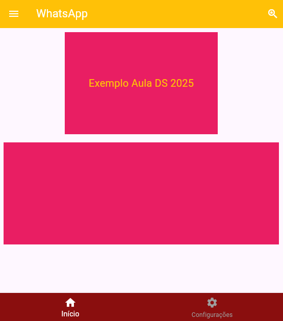

# 📱 Flutter - Primeira Tela com AppBar e BottomNavigationBar

Este projeto Flutter é um exemplo prático de como criar uma tela inicial com `AppBar`, `BottomNavigationBar`, `Column`, e `Container`. O layout foi desenvolvido para fins didáticos, especialmente em aulas de Desenvolvimento de Sistemas 2025.

## 🎯 Objetivo

Demonstrar a estrutura básica de uma tela com:

- Barra superior (`AppBar`) com ícones de menu e busca.
- Conteúdo central com texto e containers coloridos.
- Barra inferior de navegação (`BottomNavigationBar`).

## 🖼️ Layout

### AppBar

- Título: **WhatsApp**
- Ícone de menu à esquerda.
- Ícone de busca à direita com ação de `print`.

### Corpo

- Um texto central dentro de um `Container` colorido.
- Um segundo `Container` exibido abaixo.
- Todos os elementos estão centralizados com `Padding` e `SizedBox` para espaçamento.

### BottomNavigationBar

- Ícones de navegação: Início e outro item (você pode completar conforme sua necessidade).
- Cores configuradas para destacar o item selecionado.

## 🚀 Como executar

1. Certifique-se de ter o Flutter instalado.
2. Clone este repositório:

````bash
git clone https://github.com/seu-usuario/flutter_primeira_tela.git
cd flutter_primeira_tela
````

## Exemplo tela criada

