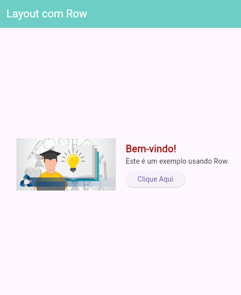

# 📱 Flutter - Exemplo com Row e Imagem

Este é um projeto simples em Flutter que demonstra o uso do widget `Row` para criar uma interface horizontal com uma imagem, textos e um botão.

## 🎯 Objetivo

Ensinar de forma prática como:

- Utilizar `Row` para organizar elementos lado a lado.
- Exibir uma imagem a partir de uma URL.
- Agrupar textos e botões com `Column`.
- Estilizar elementos com cores, tamanhos e espaçamento.

## 🧱 Estrutura do Projeto

- **`AppBar`** com título e cor personalizada.
- **`Row`** centralizado com espaçamento entre a imagem e os demais elementos.
- **Imagem** à esquerda carregada via `Image.network`.
- **Coluna (`Column`)** à direita com:
  - Título estilizado com cor e tamanho.
  - Texto descritivo.
  - Botão com ação no `onPressed`.

## 🖼️ Layout Visual

