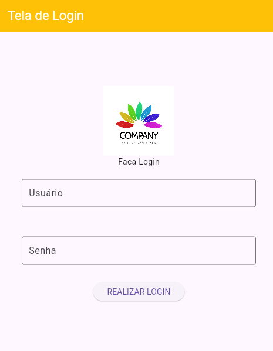

# 🔐 Flutter - Tela de Login com Coluna

Este projeto Flutter é um exemplo simples e didático de como criar uma tela de login utilizando `Column`, `TextFormField`, `ElevatedButton`, e uma imagem da internet. O projeto foi desenvolvido para reforçar o uso de colunas (`Column`) e posicionamento com `Padding` e `SizedBox`.

## 🎯 Objetivo

Demonstrar como montar uma tela de login funcional e visualmente organizada com:

- Imagem de logo no topo.
- Campos de entrada de usuário e senha.
- Botão para realizar o login.
- Organização vertical usando `Column`.

## 🖼️ Layout

### AppBar
- Título: **Tela de Login**
- Cor de fundo: `Colors.amber`
- Texto centralizado em branco.

### Corpo
- Imagem carregada por URL (logo).
- Texto "Faça Login" como título da seção.
- Campo de texto com rótulo "Usuário".
- Campo de texto com rótulo "Senha".
- Botão com o texto **"REALIZAR LOGIN"** que imprime uma mensagem no console.

## 💡 Componentes utilizados

- `MaterialApp`
- `Scaffold`
- `AppBar`
- `Column`
- `TextFormField`
- `ElevatedButton`
- `Image.network`
- `Padding` e `SizedBox`

## 🚀 Como executar

1. Certifique-se de ter o Flutter instalado.
2. Clone este repositório:

````bash
git clone https://github.com/seu-usuario/flutter_tela_login_coluna.git
cd flutter_tela_login_coluna
````


## Exemplo tela criada

