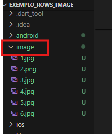
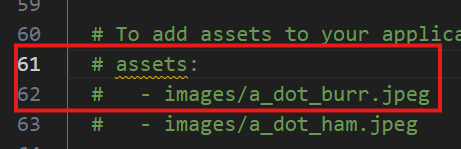
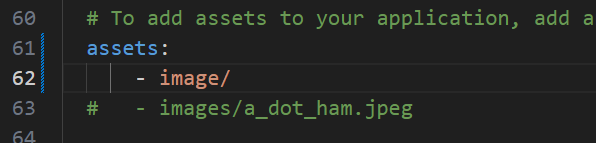
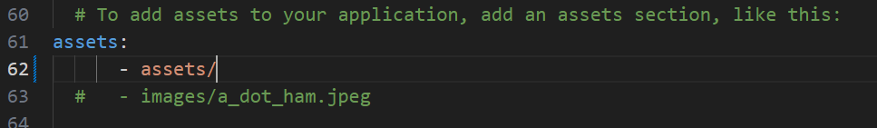
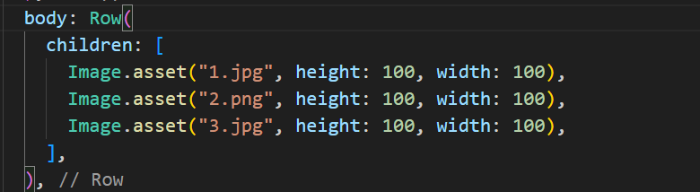

# Criando projeto usando Rows e Image Asset

## Widget Image

Existem quatro tipos básicos de imagem: o Asset, o Network, o File e o Memory.

- `Asset`: a imagem está vindo do projeto
- `Network`: a imagem vem da Internet, então fornecemos uma URL, que é o caminho da imagem, e ele baixa e mostra para nós no projeto
- `File`: pega a imagem de dentro do dispositivo
- `Memory`: pega de um arquivo da memória do dispositivo.

# Usando o tipo Asset

Primeiro baixe as imagens desejadas e salve em uma pasta com o nome `image`na raiz do projeto.



Abra o arquivo `pubspec.yaml`
- Tire o comentário da linha com **# assets**, normalmente presente na linha 61
- Tire o comentário da linha com **# image/a_dot_burr.jpeg**, , normalmente presente na linha 62



- Coloque o assets no inicio da linha 61 e o nome da pasta de imagens que foi criada na raiz do projeto.



**Obs** Caso tenha erro ao visualizar a imagem altere o nome da pasta para **assets** 



Exemplo:
````
assets:
      - assets/
  #   - images/a_dot_ham.jpeg
````
 - Não deixe espaço na linha do assets
 - Pode utilizar uma subpasta image na pasta assets

 Exemplo:
 ````
 assets:
      - assets/image
  #   - images/a_dot_ham.jpeg
 ````

Agora volte ao arquivo main.dart e acrescente na linha os `children`Image



````
 body: Row(
          children: [
            Image.asset("1.jpg", height: 100, width: 100),
            Image.asset("2.png", height: 100, width: 100),
            Image.asset("3.jpg", height: 100, width: 100),
          ],
        ),
````