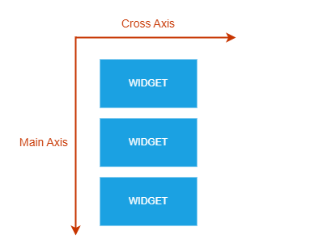
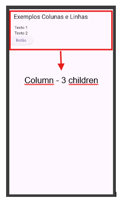
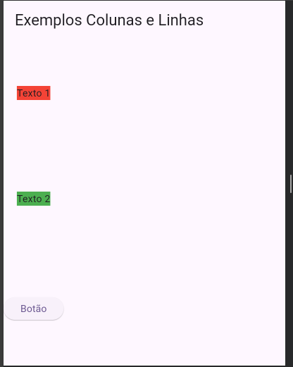

# Colunas no Flutter

No Flutter, uma coluna é um widget que organiza seus filhos verticalmente. É frequentemente usado para criar layouts verticais empilhados.

## Exemplo: Uso do Widget `Column` no Flutter

```dart
import 'package:flutter/material.dart';

void main() {
    runApp(MyApp());
}

class MyApp extends StatelessWidget {
    @override
    Widget build(BuildContext context) {
        return MaterialApp(
            home: Scaffold(
                appBar: AppBar(
                    title: Text('Exemplo de Coluna'),
                ),
                body: Column(
                    mainAxisAlignment: MainAxisAlignment.center,
                    crossAxisAlignment: CrossAxisAlignment.start,
                    children: [
                        Text('Texto 1'),
                        Text('Texto 2'),
                        Text('Texto 3'),
                    ],
                ),
            ),
        );
    }
}
```

## Propriedades Comuns do Widget `Column`

- **`mainAxisAlignment`**: Define como os widgets filhos são alinhados ao longo do eixo principal (vertical).
  - Alguns valores comuns incluem:
    - **`MainAxisAlignment.start`**: Alinha os widgets no início da coluna.
    - **`MainAxisAlignment.center`**:Alinha os widgets ao centro da coluna.
    - **`MainAxisAlignment.end`**: Alinha os widgets ao final da coluna.
    - **`MainAxisAlignment.spaceBetween`**: Distribui os widgets com o máximo de espaço entre eles.
    - **`MainAxisAlignment.spaceAround`**: Distribui os widgets com um espaço igual ao redor de cada um.
    - **`MainAxisAlignment.spaceEvenly`**: Distribui os widgets com espaços iguais entre eles
- **`crossAxisAlignment`**: Define como os widgets filhos são alinhados ao longo do eixo cruzado (horizontal).
  - Alguns valores comuns incluem:
    - **`CrossAxisAlignment.start`**:Alinha os widgets ao início da coluna.
    - **`CrossAxisAlignment.center`**:Alinha os widgets ao centro da coluna.
    - **`CrossAxisAlignment.end`**: Alinha os widgets ao final da coluna.
    - **`CrossAxisAlignment.stretch`**: Estica os widgets para que preencham toda a largura disponível.
- **`children`**: Uma lista de widgets que serão organizados verticalmente.

Colunas no Flutter são úteis para criar layouts verticais flexíveis e responsivos.



````dart
// main.dart
import 'package:flutter/material.dart';

void main() {
  runApp(const MyApp());
}

class MyApp extends StatelessWidget {
  const MyApp({super.key});
  @override
  Widget build(BuildContext context) {
    return MaterialApp(
      debugShowCheckedModeBanner: false,
      title: 'Flutter Demo',
      theme: ThemeData(
        colorScheme: ColorScheme.fromSeed(seedColor: Colors.deepPurple),
      ),
      home: Scaffold(
        appBar: AppBar(title: const Text('Exemplos Colunas e Linhas')),
        body: // main.dart
import 'package:flutter/material.dart';

void main() {
  runApp(const MyApp());
}

class MyApp extends StatelessWidget {
  const MyApp({super.key});

  // This widget is the root of your application.
  @override
  Widget build(BuildContext context) {
    return MaterialApp(
      debugShowCheckedModeBanner: false,
      title: 'Flutter Demo',
      theme: ThemeData(
        colorScheme: ColorScheme.fromSeed(seedColor: Colors.deepPurple),
      ),
      home: Scaffold(
        appBar: AppBar(title: const Text('Exemplos Colunas e Linhas')),
        body: Column(
          mainAxisAlignment: MainAxisAlignment.spaceAround,
          crossAxisAlignment: CrossAxisAlignment.center,
          children: [
            Container(color: Colors.red, child: const Text('Texto 1')),
            Container(color: Colors.green, child: const Text('Texto 2')),
            ElevatedButton(onPressed: () {}, child: Text('Botão')),
          ],
        ),
      ),
    );
  }
}
      ),
    );
  }
}

````

## Exemplo



## Exemplo usando alinhamento

```dart
import 'package:flutter/material.dart';

void main() {
    runApp(const MyApp());
}

class MyApp extends StatelessWidget {
    const MyApp({super.key});

    @override
    Widget build(BuildContext context) {
        return MaterialApp(
            debugShowCheckedModeBanner: false,
            home: Scaffold(
                appBar: AppBar(
                    title: const Text('Exemplo de Alinhamento'),
                ),
                body: Column(
                    mainAxisAlignment: MainAxisAlignment.spaceAround,
                    crossAxisAlignment: CrossAxisAlignment.center,
                    children: [
                        Container(
                            color: Colors.red,
                            child: const Text('Texto 1'),
                        ),
                        Container(
                            color: Colors.green,
                            child: const Text('Texto 2'),
                        ),
                        Container(
                            color: Colors.blue,
                            child: const Text('Texto 3'),
                        ),
                    ],
                ),
            ),
        );
    }
}
```



## Explicação

- **`mainAxisAlignment: MainAxisAlignment.spaceAround`**: Distribui os widgets filhos com espaços iguais ao longo do eixo principal.
- **`crossAxisAlignment: CrossAxisAlignment.center`**: Centraliza os widgets filhos ao longo do eixo cruzado.

Este exemplo demonstra como usar alinhamentos para organizar widgets dentro de uma coluna.
