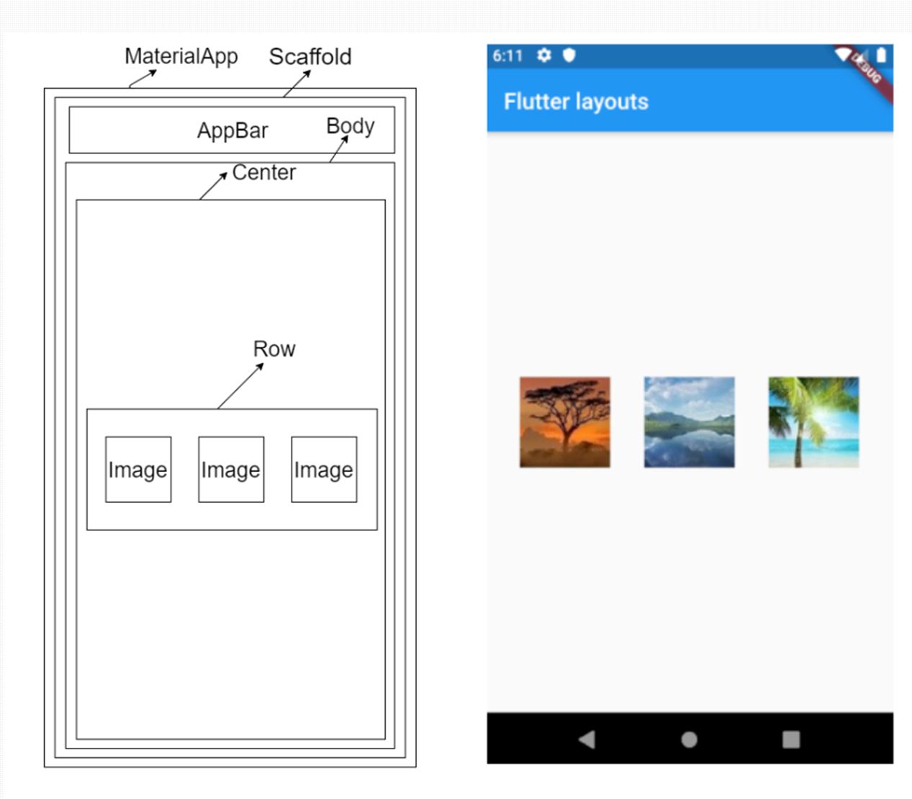

# Rows no Flutter

O widget `Row` no Flutter é utilizado para organizar widgets filhos horizontalmente em uma única linha. Ele é ideal para criar layouts onde os elementos precisam ser dispostos lado a lado.

## Propriedades Principais

- **children**: Lista de widgets que serão exibidos na linha.
- **mainAxisAlignment**: Define o alinhamento dos widgets no eixo principal (horizontal).
- **crossAxisAlignment**: Define o alinhamento dos widgets no eixo cruzado (vertical).
- **mainAxisSize**: Controla o tamanho da linha no eixo principal.



## Exemplo de Uso

```dart
import 'package:flutter/material.dart';

void main() {
    runApp(MyApp());
}

class MyApp extends StatelessWidget {
    @override
    Widget build(BuildContext context) {
        return MaterialApp(
            home: Scaffold(
                appBar: AppBar(title: Text('Exemplo de Row')),
                body: Row(
                    mainAxisAlignment: MainAxisAlignment.spaceEvenly,
                    crossAxisAlignment: CrossAxisAlignment.center,
                    children: [
                        Icon(Icons.star, size: 50, color: Colors.blue),
                        Icon(Icons.favorite, size: 50, color: Colors.red),
                        Icon(Icons.thumb_up, size: 50, color: Colors.green),
                    ],
                ),
            ),
        );
    }
}
```

## Dicas

- Utilize `Expanded` ou `Flexible` dentro de uma `Row` para ajustar dinamicamente o tamanho dos widgets.
- Combine `Row` com widgets como `Column` para criar layouts mais elaborados.

Para mais detalhes, consulte a [documentação oficial do Flutter](https://api.flutter.dev/flutter/widgets/Row-class.html).